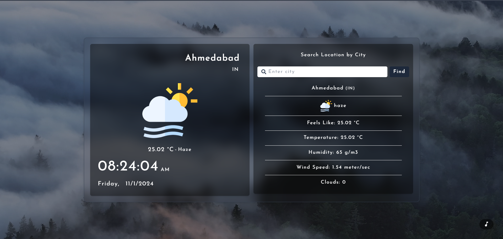

# Weather Forecast App 🌦️

A simple and interactive weather forecast application built using **React** and **Vite**. This app fetches real-time weather data for the user's current location or a user-searched city and provides a detailed forecast with temperature, humidity, wind speed, and more. Additionally, it includes dynamic background visuals and nature sounds based on the weather conditions for an immersive user experience.

## 🚀 Features

- **Real-time Weather Data**: Shows weather details for the user's current location or a searched city.
- **Dynamic Backgrounds**: Changes background images based on different weather conditions, creating an atmospheric effect.
- **Nature Sounds**: Plays soothing nature sounds based on the weather type, with an option to turn sounds on or off.
- **Live Time & Date**: Displays the current time, date, and day for the selected location.
- **Weather Details**: Provides comprehensive data such as temperature, humidity, wind speed, pressure, and more.
- **Responsive Design**: Adjusts seamlessly for various screen sizes.

## 🛠️ Tech Stack

- **Frontend**: React, Vite, Tailwind CSS
- **API**: [OpenWeather API](https://openweathermap.org/api) for fetching weather data
- **Icons**: Font Awesome for search icon and custom weather icons for conditions

## 📸 Preview

 <!-- Update this with a link to your screenshot -->

## ⚙️ Installation and Setup

1. **Clone the repository**:
   ```bash
   git clone https://github.com/your-username/weather-forecast-app.git
   cd weather-forecast-app
